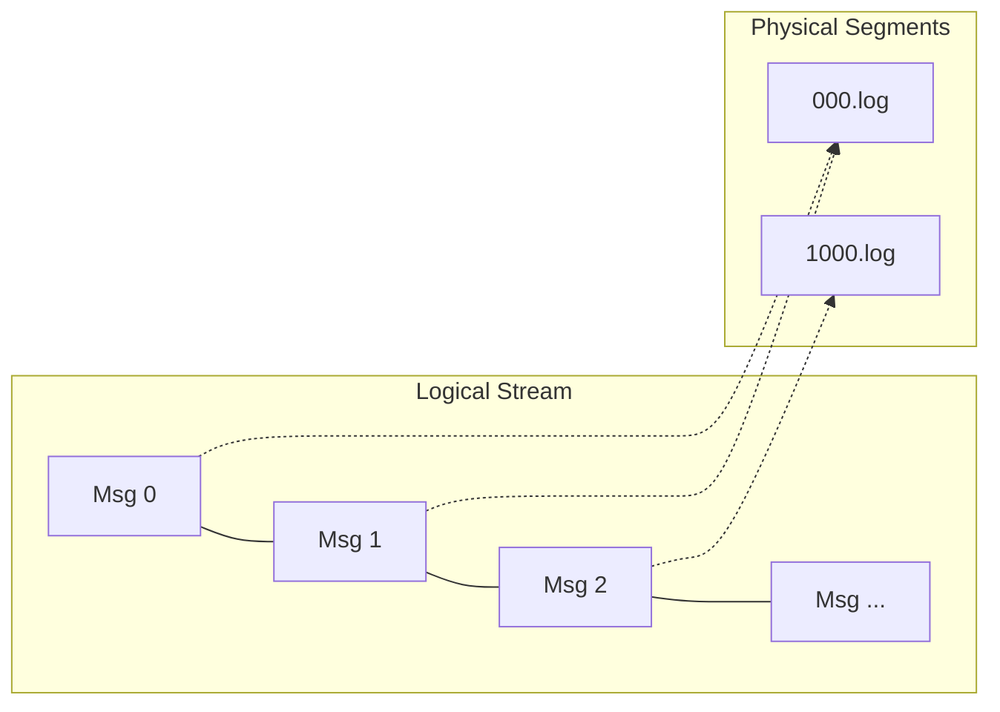
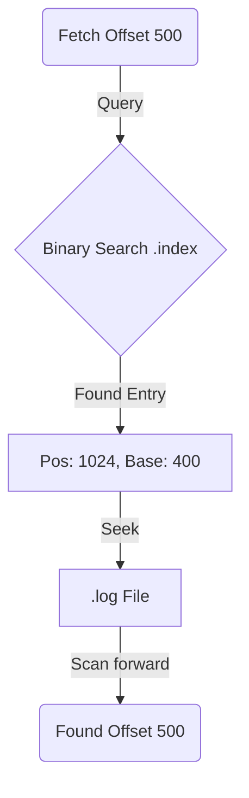

# Chapter 1: The Foundation - The Storage Engine

## Introduction
The heart of any streaming platform is its storage engine. For Logan, this was the first and most critical design decision. We weren't just building a message queue; we were building a durable event log that could stand the test of time and throughput.

## The Problem Statement
We needed a storage system that could handle:
1.  **High Write Throughput**: Ingesting gigabytes of data per second.
2.  **Sequential Access**: 99% of reads in streaming workloads are sequential (catch-up reads).
3.  **Durability**: Once acknowledged, data must never be lost.
4.  **Instant Lookups**: Consumers need to seek to arbitrary offsets efficiently.

## The Journey to the Solution

### Attempt 1: The Database Approach (B-Trees)
Initially, one might consider using an embedded Key-Value store (like RocksDB or Sled) where the key is the Offset and the value is the Message.
*   **Pros**: Easy to implement.
*   **Cons**: B-Trees (and even LSM trees to an extent) introduce overhead for random I/O during compaction. Maintaining a total order in a generic KV store is overkill when our data is naturally strictly increasing.

### The Decision: Append-Only Log
We realized that our write pattern is strictly sequential. The most efficient way to write to a spinning disk (and effectively SSDs too) is to append data to the end of a file. This minimizes disk head movement and maximizes I/O bandwidth.

Thus, the **Log** abstraction was born: an ordered, immutable sequence of records.



## Architecture Breakdown

### 1. The Log Segment
A single log file can grow indefinitely, which makes it hard to manage (delete old data, compact). We split the Log into **Segments**.
*   **Rolling**: When a segment reaches a size limit (e.g., 1GB), we close it and open a new one.
*   **Naming**: Files are named by their *base offset* (the offset of the first message in them).
    *   `00000000000000000000.log`
    *   `00000000000000001000.log`

### 2. The Indexing Problem
**Problem**: If a user asks for "Offset 500", and we have a 1GB log file, how do we find it?



*   **Naive Approach**: Scan the file from the beginning. O(N). Too slow.
*   **Full Index**: Map every offset to a position. O(1). Too memory heavy (16 bytes per message).

**Solution**: **Sparse Indexing**.
We don't index *every* message. We index every 4KB of data (or every N messages).
*   To find offset 500, we check the index.
*   Index says: "Offset 400 is at position 1024".
*   We seek to position 1024 and linearly scan until we find 500.
*   **Trade-off**: Slightly slower reads (small linear scan) for massive memory savings. This allows us to keep the entire index in RAM.

## The Code Implementation

### The Segment Structure
A `Segment` pairs the raw log data with its index.

```rust
pub struct Segment {
    pub base_offset: u64,
    pub log_file: File,     // The append-only data
    pub index: Index,       // The sparse map
}
```

### The Index Lookup
The index uses binary search to find the closest lower bound entry.

```rust
// In index.rs

/// Entry in the .index file
struct IndexEntry {
    relative_offset: u32, // Offset relative to base_offset (4 bytes)
    position: u32,        // Physical position in .log file (4 bytes)
}

impl Index {
    pub fn search(&self, target_offset: u64) -> Option<u32> {
        // We look for the largest offset <= target_offset
        // The index is naturally sorted, allowing binary search.
        let idx = self.entries.binary_search_by(|entry| {
             entry.relative_offset.cmp(&target)
        }).unwrap_or_else(|x| x - 1); // Get the element before insertion point
        
        Some(self.entries[idx].position)
    }
}
```

### Writing Data
Writes involve updating both the Log and abstractly updating the Index (though we only physically write the index entry periodically).

```rust
pub fn append(&mut self, record: Record) -> Result<()> {
    // 1. Write to Log
    let size = self.log_file.write(&record.encode())?;
    
    // 2. Update Index (Periodically)
    if self.bytes_since_last_index > INDEX_INTERVAL_BYTES {
        self.index.append(record.offset, self.current_position);
        self.bytes_since_last_index = 0;
    }
    
    self.current_position += size;
    Ok(())
}
```

## Conclusion
By restricting our access pattern to **Append-Only**, we align perfectly with the hardware's capabilities. Splitting into **Segments** allows data management, and **Sparse Indexing** solves the lookup problem efficiently.
