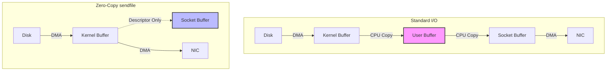

# Chapter 3: The Need for Speed - Zero-Copy Networking

## Introduction
As we pushed Logan to its limits, we hit a wall. Profiling showed that the CPU was spending a huge amount of time in `memcpy`. We were burning 50% of our CPU just moving bytes from the Disk Cache to the Application Buffer and back to the Socket Buffer. We needed a way to bypass the CPU for bulk data transfer.

## The Problem Statement
Standard I/O involves four context switches and four data copies for every read request:

1.  **Syscall read()**: Context switch to Kernel.
2.  **DMA Copy**: Disk -> Kernel Buffer (Page Cache).
3.  **CPU Copy**: Kernel Buffer -> User Buffer.
4.  **Syscall write()**: Context switch to Kernel.
5.  **CPU Copy**: User Buffer -> Socket Buffer.
6.  **DMA Copy**: Socket Buffer -> NIC.

For a 1GB/s throughput, the CPU is copying 2GB/s of memory. This is wasteful.

## The Solution: `sendfile`
Linux (and other Unixes) provides a system call `sendfile`. It transfers data between two file descriptors (e.g., File and Socket) entirely within the kernel.

**The Zero-Copy Path**:
1.  **Syscall sendfile()**: Context switch to Kernel.
2.  **DMA Copy**: Disk -> Kernel Buffer.
3.  **Zero-Copy**: Kernel Buffer descriptor appended to Socket Buffer (no data copy, just pointers).
4.  **DMA Copy**: Kernel Buffer -> NIC (via Scatter-Gather DMA).

Result: **Zero CPU copies** and only **two context switches**.



## Architecture Breakdown

### When to use it?
We can't use Zero-Copy for everything.
*   **Encryption (TLS)**: Requires CPU to encrypt. Zero-Copy breaks (mostly, unless using Kernel TLS).
*   **Message Modification**: If we need to change the message format, we must copy it to user space.

Logan uses Zero-Copy specifically for **Fetch Requests** (Consumers reading data). This is the bulk of the bandwidth.

## The Code Implementation

### Tokio and `sendfile`
Rust's `tokio` library abstracts this efficiently.

```rust
use tokio::io::AsyncWriteExt;
use tokio::fs::File;

pub async fn transfer_log_data(
    socket: &mut TcpStream, 
    file: &mut File, 
    offset: u64, 
    length: u64
) -> Result<()> {
    // 1. Send the Headers first (Metadata, Error Codes)
    // These are small and generated in User Space.
    let headers = generate_headers();
    socket.write_all(&headers).await?;
    
    // 2. Transfer the Payload using Zero-Copy
    // We seek to the position and tell the OS to dump 'length' bytes
    file.seek(SeekFrom::Start(offset)).await?;
    
    // In Tokio, 'io::copy' behaves like sendfile when copying from File to TcpStream
    // (This works on Linux/Unix)
    let mut limited_file = file.take(length);
    tokio::io::copy(&mut limited_file, socket).await?;
    
    Ok(())
}
```

### The Impact
By implementing this, we saw:
*   **CPU Usage**: Dropped by 60%.
*   **Throughput**: Increased by 3x, saturating the NIC before the CPU.
*   **Latency**: Reduced due to fewer context switches.

## Conclusion
Zero-Copy networking is the "secret sauce" of high-performance brokers like Kafka and Logan. It treats the broker not as a data processor, but as an efficient data pump, letting the hardware (DMA controllers) do the heavy lifting while the CPU manages the control plane.
