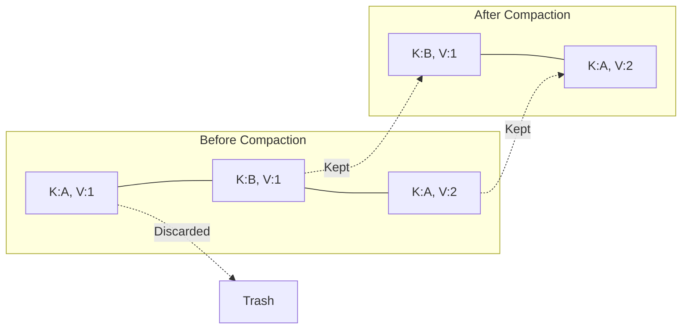

# Chapter 5: Cleaning House - Log Compaction

## Introduction
Streaming platforms often deal with immense infinite streams of data. Standard retention policies (delete after 7 days) work for "Events" (e.g., website clicks). But what if we are storing "State" (e.g., User Profile Updates)? You can't just delete old updates if the user hasn't updated their profile in 8 days; you'd lose their existence!

We need a way to keep the *snapshot* of the data while discarding the *history*.

## The Problem Statement
1.  **Infinite Growth**: Storing every update to a database row forever fills the disk.
2.  **State Recovery**: To rebuild the state of a database from a log, we need to replay history. We want to replay only the *latest* version of each key.

## The Solution: Log Compaction
Log Compaction changes the semantics of the Log.
*   **Standard Log**: "Preserve all records for X time."
*   **Compacted Log**: "Preserve the latest record for every Key."

This effectively turns the Logan Topic into a **Key-Value Store** persisted as a log.



## Architecture Breakdown

### The Log Cleaner
The cleaner is a background thread (or Actor) that wakes up periodically.
It divides the log into:
1.  **The Head (Active)**: New data being written. Mutable. Not compacted yet.
2.  **The Tail (Clean)**: Old immutable segments. Compacted.

### The Algorithm: Two-Pass Mark & Sweep
The challenge is doing this with minimal memory usage.

**Phase 1: Build the Offset Map**
The cleaner reads the *Dirty* portion of the log (from Tail to Head).
It builds a HashMap: `Key -> Offset`.
*   If we see Key "A" at offset 10, Map: `A -> 10`.
*   Later we see Key "A" at offset 50, Map: `A -> 50`.
*   The map now holds the location of the *latest* version of every key.

**Phase 2: Rewrite Segments**
The cleaner iterates through the old segments again.
For every record at `CurrentOffset` with `Key`:
*   Check Map: `TargetOffset = Map.get(Key)`.
*   If `CurrentOffset != TargetOffset`: This is an old value. **Discard**.
*   If `CurrentOffset == TargetOffset`: This is the latest value. **Keep**.

Messages that are "Kept" are copied to a new `.clean` segment file. The old large segment is deleted and replaced by the small clean one.

## The Code Implementation

### The Cleaner Loop

```rust
pub fn clean_segments(segments: Vec<Segment>) -> Result<Vec<Segment>> {
    // 1. Build Offset Map
    // Optimisation: We can use a specialized compact hash map or even an on-disk map if RAM is tight.
    let mut offset_map: HashMap<Vec<u8>, u64> = HashMap::new();
    
    for segment in &segments {
        let mut iterator = segment.iter();
        while let Some(record) = iterator.next() {
            if let Some(key) = record.key {
                offset_map.insert(key, record.offset);
            }
        }
    }
    
    // 2. Rewrite
    let mut cleaned_segments = Vec::new();
    for segment in segments {
        let new_path = segment.path.with_extension("log.clean");
        let mut new_segment = Segment::open(&new_path)?;
        
        let mut iterator = segment.iter();
        while let Some(record) = iterator.next() {
             if let Some(key) = &record.key {
                 if let Some(&latest) = offset_map.get(key) {
                     if record.offset == latest {
                         // KEEP
                         new_segment.append(record)?;
                     } else {
                         // DROP (Implicitly, by not appending)
                     }
                 }
             }
        }
        
        // Finalize atomic swap
        new_segment.rename_to_original()?;
        cleaned_segments.push(new_segment);
    }
    
    Ok(cleaned_segments)
}
```

## Conclusion
Log Compaction bridges the gap between Event Streams and Databases. It allows Logan to support use cases like "Database Change Data Capture (CDC)" efficiently, ensuring that consumers can always bootstrap the full state of a system without replaying terabytes of redundant history.
