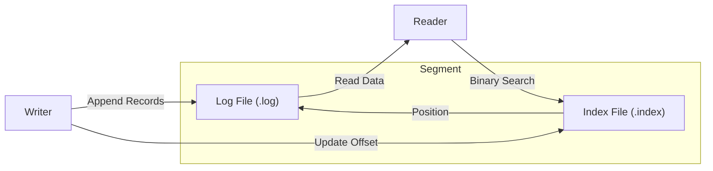

# The Logan Story: A Journey to Production

Logan is not just a message broker; it's a journey into the depths of distributed systems engineering. This document chronicles our architectural evolution, explaining the "Why" and "How" behind every major decision.

## Chapter 1: The Foundation (Storage Engine)

Every message broker needs a solid ground to stand on. For Logan, we chose an **Append-Only Log** architecture, the gold standard for high-throughput event streaming.

### The Challenge
We needed a way to store terabytes of data while ensuring:
1.  **Sequential Writes**: To maximize disk I/O throughput.
2.  **Fast Lookups**: To find messages by offset instantly.

### The Solution: Logs and Indices

We split the storage into **Segments**. Each segment is a pair of files:
-   `000.log`: The raw data.
-   `000.index`: A sparse index mapping logical offsets to physical positions.



### How it works in Code

We use a simple mapping mechanism for the index. A sparse index entry is just 8 bytes: 4 bytes for the relative offset and 4 bytes for the physical position.

```rust
// Simplified Sparse Index Structure
struct IndexEntry {
    relative_offset: u32, // 4 bytes
    position: u32,        // 4 bytes
}

impl Index {
    fn search(&self, target_offset: u64) -> Option<u32> {
        // Binary search the memory-mapped index file
        self.entries.binary_search_by(|entry| {
            entry.relative_offset.cmp(&target_offset)
        }).map(|idx| self.entries[idx].position).ok()
    }
}
```

---

## Chapter 2: Trust No One (Data Integrity)

Speed is nothing without trust. In distributed systems, bits flip, disks rot, and networks garble packets.

### The Challenge
How do we ensure that the message you read is *exactly* the message you wrote?

### The Solution: CRC32 Validation

We introduced a wrapper around every record on disk. Before any data is returned to the user, we run a mathematical verification.

**The On-Disk Format:**
```
+----------------+----------------+--------------------------+
| Length (4B)    | CRC32 (4B)     | Payload (N Bytes)        |
+----------------+----------------+--------------------------+
```

When Logan reads a record:
1.  It reads the payload.
2.  It calculates the checksum on the fly.
3.  It compares it with the stored `CRC32`.
4.  If they match, proceed. If not, **CorruptDataError**.

### The Implementation

We use the `crc32fast` crate for hardware-accelerated checksums.

```rust
// Validation Logic
fn validate_record(data: &[u8], stored_crc: u32) -> Result<()> {
    let actual_crc = crc32fast::hash(data);
    if actual_crc != stored_crc {
        return Err(CorruptDataError);
    }
    Ok(())
}
```

---

## Chapter 3: The Need for Speed (Zero-Copy Networking)

As Logan grew, we noticed a bottleneck. Moving data from Disk to User Space (RAM) and then to Kernel Space (NIC) was burning CPU cycles just to copy bits around.

### The Challenge
Kafka clients want data FAST. We wanted to saturate the 10Gbps network limits without pegging the CPU.

### The Solution: `sendfile`

We implemented **Zero-Copy Networking**. Instead of bringing data into the application, we tell the kernel: *"Take these bytes from this file descriptor and put them directly onto that socket descriptor."*

**Before (Standard Read/Write):**
Kernel (Disk) -> User Space (Buffer) -> Kernel (Socket)

**After (Zero-Copy):**
Kernel (Disk) -------------------------> Kernel (Socket)


### The Magic of `sendfile`

By delegating the transfer to the OS, we avoid the overhead of copying data into our application's memory space.

```rust
// Simplified Zero-Copy Logic
async fn handle_fetch(socket: &mut TcpStream, file: &File, offset: u64, len: u64) {
    // 1. Send Headers (Metadata) normally
    socket.write_all(&headers).await?;

    // 2. Zero-Copy the payload directly from Disk -> Socket
    // This uses the sendfile syscall under the hood
    let mut file_handle = file.take(len);
    tokio::io::copy(&mut file_handle, socket).await?;
}
```

---

## Chapter 4: Compressing Time and Space (Implemented)

Our next frontier was efficiency. By implementing **Record Batching** (Kafka v2 format) and **Compression** (Snappy, LZ4), we aimed to:
1.  Amortize network overhead by sending fewer, larger packets.
2.  Reduce disk usage by 50% or more.
3.  Improve throughput.

### The Implementation
We added `logan-protocol/src/batch.rs` to handle the complex Kafka v2 `RecordBatch` structure, including support for **Varint** encoding and **Zstd/Snappy/LZ4** compression algorithms.

**Compression Strategy:**
-   **Snappy**: High speed, reasonable compression. Good for real-time.
-   **LZ4**: Extremely fast decompression.
-   **Zstd**: Best compression ratio (future proofing).

### Compression in Action

We wrap the batch of records in a compressed envelope.

```rust
// Writing a compressed batch
let mut encoder = match compression {
    Compression::Snappy => SnapEncoder::new(buffer),
    Compression::Lz4 => Lz4Encoder::new(buffer),
    _ => buffer,
};

for record in records {
    encoder.write_all(&record.encode())?;
}
let compressed_batch = encoder.finish()?;
```
-   **LZ4**: Extremely fast decompression.
-   **Zstd**: Best compression ratio (future proofing).


---

## Chapter 5: Cleaning House (Log Compaction)

As we moved towards supporting stateful applications (like KTables or database changelogs), we faced a new problem. Sometimes, you don't care about the *history* of a key, but only its *latest value*.

### The Challenge
Infinite retention consumes infinite disk. Deleting old segments based on time (Retention) loses the latest state if the key hasn't been updated recently. We needed **Log Compaction**.

### The Solution: `LogCleaner`

We implemented a mechanism to "rewrite" history.
1.  **Build Offset Map**: The cleaner scans the log (head to tail) and builds a map: `Key -> LatestOffset`.
2.  **Rewrite**: It iterates through old segments. If a record's offset matches the `LatestOffset` in the map, it is kept. Otherwise, it is discarded (superseded).
3.  **Swap**: The old segment file is atomically replaced by the new, smaller `.clean` file.


### Compaction Logic

The cleaner operates in two passes: Build Map and Rewrite.

```rust
// Pass 1: Build the Offset Map
let mut offset_map = HashMap::new();
for record in log.read_all() {
    offset_map.insert(record.key, record.offset);
}

// Pass 2: Rewrite Segments
for segment in segments {
    let mut new_segment = Segment::create("new.log");
    for record in segment.read() {
        // Only keep if this is the LATEST offset for this key
        if offset_map.get(&record.key) == Some(&record.offset) {
            new_segment.append(record);
        }
    }
    segment.replace_with(new_segment);
}
```

This ensures that for any given key, at least the last known value is always preserved, effectively turning the Log into a persistent Key-Value Store.
